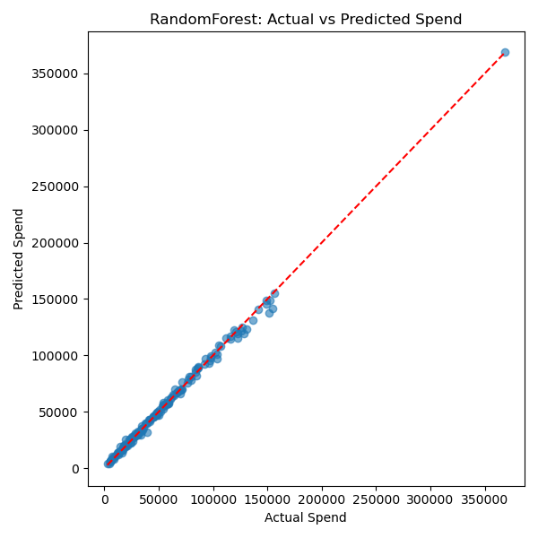
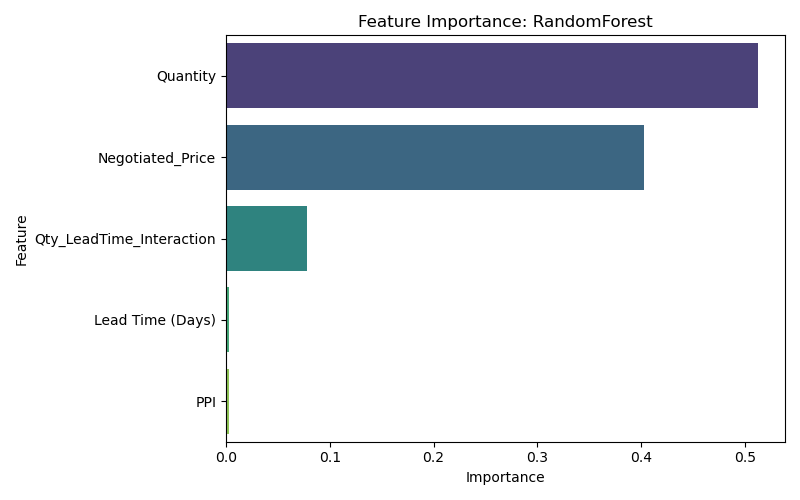
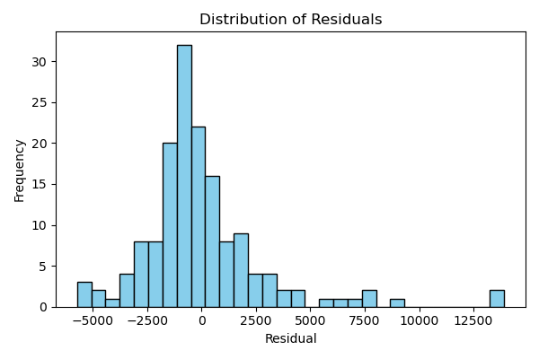
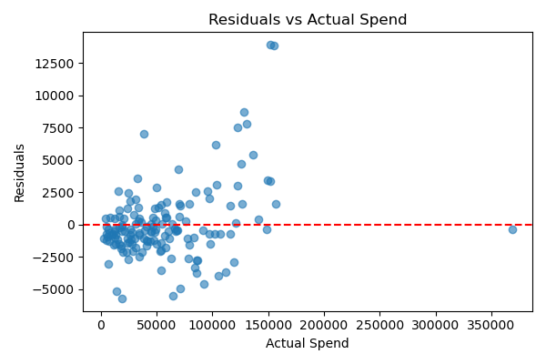

# 📊 ERP Spend Forecasting App with Streamlit & Machine Learning

This project is a **production-ready AI-powered forecasting dashboard** that predicts procurement spend using historical ERP-style data, macroeconomic indicators (PPI), and machine learning models. Built for business analysts and decision-makers, the app provides accurate spend predictions, cost breakdowns, and confidence metrics in real-time.



---

## 🚀 Key Features

- 🧠 **Trained ML Models**: Linear Regression, Ridge, Lasso, Random Forest, and XGBoost — with **Random Forest** as the final model (**R² = 0.9966**).
- 📈 **Real-Time PPI Integration**: Automatically fetches category-specific Producer Price Index data from the FRED API.
- 📊 **Streamlit Dashboard**: Interactive forecasting UI with metrics, cost breakdowns, and trend charts.
- 📦 **Modular Pipeline**: Separate scripts for data preparation, model training, and deployment.
- 📁 **Versioned Artifacts**: Saves model metadata, evaluation plots, and feature importances for auditability.

---

## 🗂️ Project Structure

```
erp_forecasting_project/
│
├── data/
│   ├── raw/                  # Original ERP-style procurement dataset
│   └── processed/            # Cleaned and enriched data with PPI
│
├── models/
│   ├── best_model.joblib
│   ├── feature_names.joblib
│   ├── model_metadata.joblib
│   ├── feature_importance_plot.png
│   ├── predicted_vs_actual.png
│   ├── residuals_histogram.png
│   ├── residuals_vs_actual.png
│   └── model_evaluation_summary_*.csv
│
├── src/
│   ├── data_preparation.py         # Cleans, imputes, and enriches dataset
│   ├── model_testing_training.py   # Trains models and saves evaluation
│   └── streamlit_fin_version.py    # Full Streamlit dashboard app
│
├── .env                   # Stores FRED API key (gitignored)
├── .gitignore
├── requirements.txt
├── Procfile
└── README.md
```

---

## 📌 How It Works

### 🔹 Step 1: Data Preparation

- 📥 Loads the raw ERP-style procurement dataset from `data/raw/`
- 🏷️ Randomly assigns realistic `Item_Category` and `Department` labels
- 🧮 Derives key features:
  - `Spend` = Quantity × Negotiated Price  
  - `Lead Time (Days)` = Delivery Date – Order Date  
  - `Cost_per_Unit`, `Markup_%`, and interaction features
- 🌐 Fetches **real-time Producer Price Index (PPI)** from [FRED API](https://fred.stlouisfed.org/)
- 🔁 Merges PPI into dataset and imputes missing entries with rolling average
- 🧼 Handles missing values with group-level imputation
- 🚫 Filters invalid rows (zero or negative quantity or price)
- 📉 Removes outliers using **Z-score method**
- 📈 Saves cleaned dataset to `data/processed/cleaned_procurement_with_ppi_extended.csv`

### 🔹 Step 2: Model Training

- 🚂 Loads cleaned dataset and selects 4 key features
- ✂️ Performs 80/20 train-test split
- 📉 Applies StandardScaler for linear models (not for tree models)
- 🤖 Trains:
  - Linear Regression
  - Ridge
  - Lasso
  - Random Forest
  - XGBoost
- 📊 Evaluates using:
  - MAE, RMSE, R², Cross-Validation R²
- 🏆 Selects **RandomForest** based on highest R² score
- 📈 Saves:
  - `best_model.joblib`, `feature_names.joblib`, `model_metadata.joblib`
  - Evaluation plots and summary CSV

### 🔹 Step 3: Streamlit Forecasting App

- Loads model and feature pipeline
- Accepts user input: quantity, unit price, lead time, item category
- Fetches real-time PPI for the selected category
- Predicts:
  - Total Spend
  - Cost per Unit
- Displays:
  - 📊 Cost breakdown (Base, Market Risk, Seasonal)
  - 🎯 Confidence intervals
  - 📉 PPI trend
  - 📥 Exportable outputs (CSV)

---

## 📷 Sample Visualizations

**Feature Importances**  


**Predicted vs Actual Spend**  


**Residual Distribution**  


**Residuals vs Actual Spend**  


---

## ⚙️ Setup Instructions

### 1. 🔐 Add `.env` file with your FRED API key

```
FRED_API_KEY=your_actual_fred_api_key
```

### 2. 🛠️ Install Dependencies

```bash
pip install -r requirements.txt
```

### 3. ▶️ Run the Streamlit App

```bash
streamlit run src/streamlit_fin_version.py
```

---

## ☁️ Deploy to Streamlit Cloud

1. Push to a public GitHub repo  
2. Add `.env` as a **secret** in Streamlit Cloud dashboard  
3. Set main file to: `src/streamlit_fin_version.py`  
4. Deploy!

---

## 📈 Final Model Performance (Random Forest)

| Metric        | Value         |
|---------------|---------------|
| **R² Score**  | **0.9966**    |
| **MAE**       | **$1,781.30** |
| **RMSE**      | **$2,733.56** |
| **CV R²**     | **0.9684 ± 0.0283** |

---

## 📚 References

- [FRED API Documentation](https://fred.stlouisfed.org/docs/api/fred/)
- [Kaggle Procurement Dataset](https://www.kaggle.com/datasets/shahriarkabir/procurement-kpi-analysis-dataset)
- [Streamlit Docs](https://docs.streamlit.io/)

---

> Built 💡 data-driven forecasting
