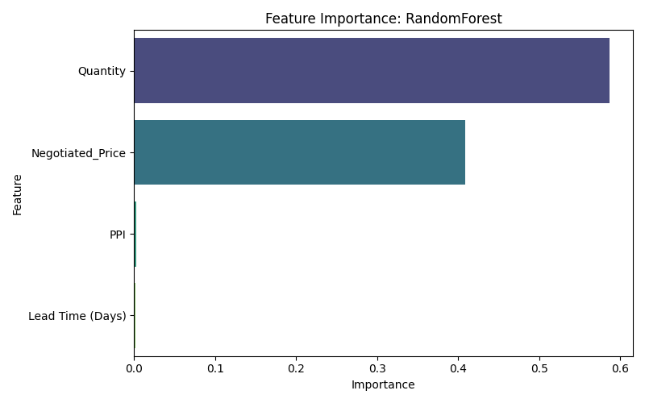

# 📊 ERP Spend Forecasting App with Streamlit & Machine Learning

This project is a **production-ready AI-powered forecasting dashboard** that predicts procurement spend using historical ERP-style data, macroeconomic indicators (PPI), and machine learning models. Built for business analysts and decision-makers, the app provides accurate spend predictions, cost breakdowns, and confidence metrics in real-time.


---

## 🚀 Key Features

- 🧠 **Trained ML Models**: Linear Regression, Ridge, Lasso, Random Forest, and XGBoost — with Random Forest as the final model (R² = 0.9963).
- 📈 **Real-Time PPI Integration**: Automatically fetches category-specific Producer Price Index data from the FRED API.
- 📊 **Streamlit Dashboard**: Interactive forecasting UI with metrics, cost breakdowns, and trend charts.
- 📦 **Modular Pipeline**: Separate scripts for data preparation, model training, and deployment.
- 📁 **Versioned Artifacts**: Saves model metadata, evaluation plots, and feature importances for auditability.

---

## 🗂️ Project Structure

```
erp_forecasting_project_3/
│
├── data/
│   ├── raw/                      # Original ERP-style procurement dataset
│   └── processed/                # Cleaned and enriched data with PPI
│
├── models/
│   ├── best_model.joblib         # Final selected model (Random Forest)
│   ├── feature_importance_plot.png
│   ├── predicted_vs_actual.png
│   ├── residuals_histogram.png
│   ├── residuals_vs_actual.png
│   ├── model_metadata.joblib
│   └── model_evaluation_summary_*.csv
│
├── src/
│   ├── data_preparation.py       # Cleans, imputes, and enriches dataset
│   ├── model_testing_training.py # Trains models and saves evaluation
│   └── streamlit_fin_version.py  # Full Streamlit dashboard app
│
├── .env                          # Stores FRED API key (gitignored)
├── .gitignore
├── requirements.txt
├── Procfile
└── README.md
```

---

## 📌 How It Works

### 🔹 Step 1: Data Preparation

- 📥 Loads the raw ERP-style procurement dataset from `data/raw/`
- 🏷️ Randomly assigns realistic `Item_Category` and `Department` labels using predefined lists (mimicking Mockaroo-style logic)
- 🧮 Derives key features:
  - `Spend` = Quantity × Negotiated Price
  - `Lead Time (Days)` = Delivery Date – Order Date
  - `Qty_LeadTime_Interaction` = Quantity × Lead Time
  - `Cost_per_Unit` and `Markup_%`
  - Flags abnormally high markups
- 🌐 Fetches **real-time Producer Price Index (PPI)** by item category using the [FRED API](https://fred.stlouisfed.org/)
- 🔁 Merges PPI values into the dataset using `Order Month` and applies rolling imputation for missing entries
- 🧼 Performs smart imputation for missing values by group-level means or modes
- 🚫 Filters out invalid rows with zero or negative Quantity or Price
- 📉 Removes statistical outliers using **Z-score method** across multiple columns (e.g., Unit Price, Lead Time)
- 🔧 Recalculates and cleans up negative or missing lead time issues
- 📈 Saves the final cleaned and enriched dataset to `data/processed/cleaned_procurement_with_ppi_extended.csv`


### 🔹 Step 2: Model Training

- 🚂 Loads the cleaned dataset from `data/processed/cleaned_procurement_with_ppi_extended.csv`
- 🧪 Selects 5 key engineered features: Quantity, Negotiated Price, Lead Time, PPI, and Quantity × Lead Time interaction
- ✂️ Splits the dataset into 80% training and 20% testing
- 📉 Applies StandardScaler **only for linear models** (Linear, Ridge, Lasso); tree-based models (Random Forest, XGBoost) are trained without scaling
- 🤖 Trains and evaluates the following models:
  - **Linear Regression**
  - **Ridge Regression**
  - **Lasso Regression**
  - **Random Forest Regressor**
  - **XGBoost Regressor**
- 📊 Evaluates using:
  - **MAE** (Mean Absolute Error)
  - **RMSE** (Root Mean Square Error)
  - **R²** (Coefficient of Determination)
  - **Cross-Validation R²**
- 🏆 Selects the **best model by test R²** score
- 🔍 For tree-based models, generates **feature importance plots**
- 📈 Generates evaluation visuals:
  - Actual vs Predicted Plot
  - Residuals vs Actual Spend
  - Histogram of Residuals
- 💾 Saves all artifacts:
  - `best_model.joblib`, `feature_names.joblib`, `model_metadata.joblib`
  - Plots in `models/` folder
  - Model evaluation summary CSV


### 🔹 Step 3: Streamlit Forecasting App

- Loads best model + scaler + features
- Accepts input: quantity, unit price, lead time, item category
- Fetches real-time PPI for selected category
- Predicts Total Spend and Cost per Unit
- Displays:
  - 📊 Cost breakdown (Base, PPI, Lead Time)
  - 🎯 Confidence (R², MAE, RMSE)
  - 📉 PPI trend chart
  - 📥 CSV export

---

## 📷 Sample Visualizations

**Feature Importances**


**Predicted vs Actual**


**Residuals**


---

## ⚙️ Setup Instructions

### 1. 🔐 Add `.env` file with your FRED API key
```
FRED_API_KEY=your_actual_fred_api_key
```

### 2. 🛠️ Install Dependencies
```
pip install -r requirements.txt
```

### 3. ▶️ Run the Streamlit App
```
streamlit run src/streamlit_fin_version.py
```

---

## ☁️ Deploy to Streamlit Cloud

1. Push to a public GitHub repo
2. Add `.env` as a **secret** in Streamlit Cloud dashboard
3. Set main file to: `src/streamlit_fin_version.py`
4. Deploy!

---

## 📈 Final Model Performance (Random Forest)

| Metric        | Value       |
|---------------|-------------|
| R² Score      | 0.9963      |
| MAE           | $1,854.04   |
| RMSE          | $2,832.93   |
| Cross-Val R²  | 0.9689 ± 0.0266 |

---

## 📚 References

- [FRED API Documentation](https://fred.stlouisfed.org/docs/api/fred/)
- [Kaggle Procurement Dataset](https://www.kaggle.com/datasets/shahriarkabir/procurement-kpi-analysis-dataset)
- [Streamlit Docs](https://docs.streamlit.io/)

---

> Built with 💡 operational intelligence and data-driven forecasting
